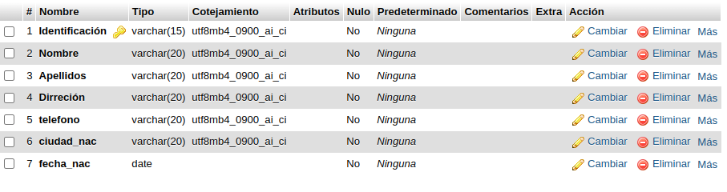

# INTRODUCCIÓN A SQL

1. CREACIÓN DE UNA BASE DE DATOS (BD)CON MYSQL USANDO phpMYAdmin

## Creación tabla cliente 
### Diccionario de datos
|campo|tipo de dato|longitud|
|-----|------------|--------|
|***identificacion**|vachar|15|
|nombre|vachar|20|
|apellidos|varchar|20|
|dirreción|varchar|25|
|telefono|varchar|20|
|ciudad_nac|varchar|20|
|fecha_nac|date|

### DICCIONARIO DE DATOS EN phpMYAdmin

### REGISTRO DE DATOS EN TABLA CLIENTE 

#### CODIGO SQL DE INSERCIÓN DE UN REGISTRO A LA TABLA CLIENTE 

INSERT INTO `clientes` (`Identificación`, `Nombre`, `Apellidos`, `Dirreción`, `telefono`, `ciudad_nac`, `fecha_nac`) VALUES ('101', 'ANGELICA', 'LOPEZ AYOLA ', 'CALLE 10A #15-25', '3115738594', 'SANTA MARTA ', '2005-04-17');

#### SEGUNDO REGISTRO EN phpMYAdmin

INSERT INTO `clientes` (`Identificación`, `Nombre`, `Apellidos`, `Dirreción`, `telefono`, `ciudad_nac`, `fecha_nac`) VALUES ('102', 'kevin', 'solano', 'calle 1 #16-03', '3197794793', 'bogota', '2005-07-07');

### TERCER  REGISTRO 

INSERT INTO `clientes` (`Identificación`, `Nombre`, `Apellidos`, `Dirreción`, `telefono`, `ciudad_nac`, `fecha_nac`) VALUES ('103', 'AYLYN', 'GARCIA', 'LA LIBERTAD', '3214243660', 'MERIDAD', '2005-01-02');

### CUARTO REGISTRO 

INSERT INTO `clientes` (`Identificación`, `Nombre`, `Apellidos`, `Dirreción`, `telefono`, `ciudad_nac`, `fecha_nac`) VALUES ('104', 'NAYARIT', 'SAMBRANO ', 'GUARIGUA', '32038361030', 'SAN GIL', '2006-12-30');
### QUINTO REGISTRO 

INSERT INTO `clientes` (`Identificación`, `Nombre`, `Apellidos`, `Dirreción`, `telefono`, `ciudad_nac`, `fecha_nac`) VALUES ('105', 'ALEXANDER', 'TORRES', 'PABLO VI', '3204225254', 'SAN GIL', '2007-04-19');

### SEXTO REGISTRO

INSERT INTO `clientes` (`Identificación`, `Nombre`, `Apellidos`, `Dirreción`, `telefono`, `ciudad_nac`, `fecha_nac`) VALUES ('106', 'IVAN ', 'RUEDA', 'PABLO VI', '3188299609', 'SAN GIL', '2007-06-15');
### SEPTIMO REGISTRO 
INSERT INTO `clientes` (`Identificación`, `Nombre`, `Apellidos`, `Dirreción`, `telefono`, `ciudad_nac`, `fecha_nac`) VALUES ('107', 'JHONES', 'VAQUIRO', 'VILLA OLIMPICA ', '3212721431', 'BOGOTA', '2005-03-18');

